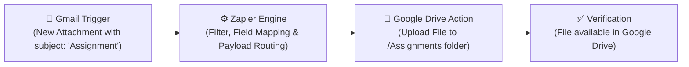

# Session 13 – Task 2: Zapier Workflow Guide (Gmail to Google Drive)

## 1. Workflow Objective
Automate a cloud integration using the **Zapier** platform: Whenever a new email arrives in your **Gmail** inbox with the subject containing `'Assignment'`, automatically extract the email's attachment and upload it into a designated **Google Drive** folder.

---

## 2. Architecture & Data Flow



---

## 3. Step-by-Step Zapier Configuration Guide

### Step 1: Create a New Zap
1. Log in to [zapier.com](https://zapier.com) and click **"Create Zap"**.
2. Name the Zap: `Gmail Assignment Attachments to Google Drive`.

### Step 2: Configure the Trigger (Gmail)
1. **App**: Choose **Gmail**.
2. **Trigger Event**: Select **"New Attachment"** *(or "New Email Matching Search")*.
3. **Account**: Authenticate and connect your Google/Gmail account.
4. **Trigger Configuration**:
   - **Search String**:
     ```text
     subject:Assignment has:attachment
     ```
     *(This ensures the Zap only fires for relevant emails and avoids triggering on emails without attachments).*
   - **Label/Mailbox**: `INBOX`
5. **Test Trigger**:
   - Send an email to yourself with the subject `"Assignment Submission - Session 13"` and attach a sample file (e.g. `Session13_Patel.pdf`).
   - Click **"Test Trigger"** in Zapier. Zapier will fetch the sample email and extract metadata (sender, subject, attachment file reference).

---

### Step 3: Configure the Action (Google Drive)
1. **App**: Choose **Google Drive**.
2. **Action Event**: Select **"Upload File"**.
3. **Account**: Authenticate and select your Google Drive account.
4. **Action Field Mapping**:
   | Field | Setting / Value | Explanation |
   | :--- | :--- | :--- |
   | **Drive** | `My Google Drive` | The destination drive |
   | **Folder** | `/Assignments` or `/Agentic AI/Assignments` | Specific folder where attachments should land |
   | **File** | `Step 1. Attachment: (Exists but not shown)` | The actual binary file stream passed from Gmail |
   | **File Name** | `Step 1. Attachment Details: File Name` *(optional)* | Preserves the student/sender's original filename |
   | **Convert to Document** | `False` | Preserves native file format (PDF, DOCX, ZIP, JPG) |

---

### Step 4: Test and Publish
1. Click **"Test Step"**.
2. Check your Google Drive under `/Assignments` to confirm that the test attachment was uploaded successfully.
3. Click **"Publish"** to turn on the automated Zap.

---

## 4. Advanced Considerations & Edge Cases

| Scenario | Challenge | Solution in Zapier |
| :--- | :--- | :--- |
| **Multiple Attachments** | An email contains 3 PDF files | Enable Zapier's **"Looping by Zapier"** utility to iterate over each attachment in the array. |
| **Duplicate Filenames** | Two students submit `assignment.pdf` | Prefix the filename with timestamp or sender: `{{Step 1. Date}}-{{Step 1. Sender}}-{{Step 1. Filename}}`. |
| **Large Files (>100MB)** | Exceeds standard email attachment limits | Instruct senders to share a Google Drive link, and trigger on "New Email" with link parsing. |
